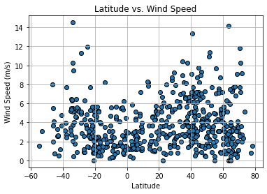

# python-api-challenge
Module 6 API challenge for the Vanderbilt Data Analytics Bootcamp

# WeatherPy
## Latitude vs. Temperature

## Latitude vs. Humidity

## Latitude vs. Cloudiness

## Latitude vs. Wind Speed

## Latitude vs. Temperature

## Latitude vs. Humidity

## Latitude vs. Cloudiness

## Latitude vs. Wind Speed

# VacationPy

